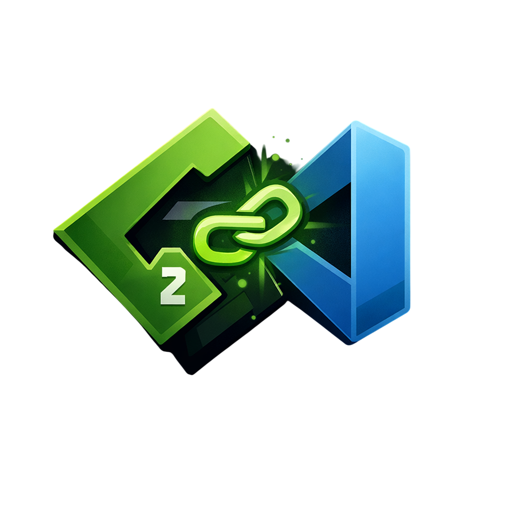
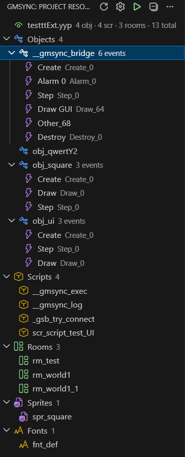
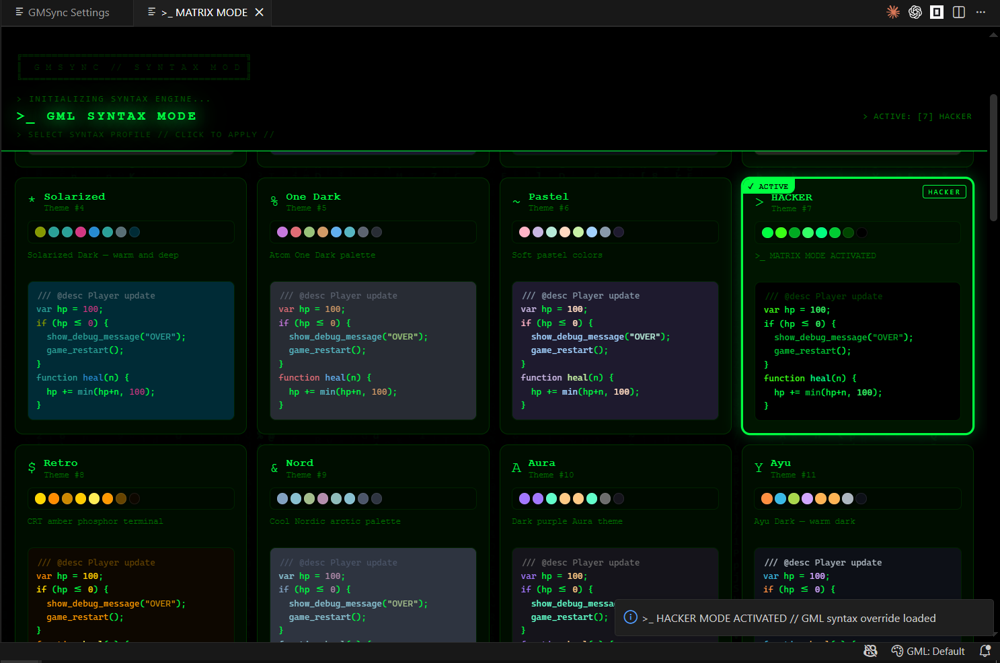
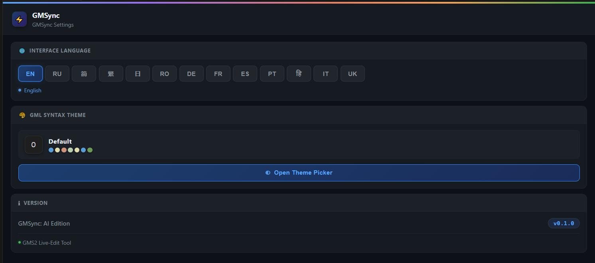

  

  # GMSync

  **Live-edit your GameMaker Studio 2 project from VS Code — without restarting the IDE.**

  
  
  
  

---

*Modify GML events and create resources — GMS2 picks up changes instantly.*

---

## Features

### No IDE Restart Required
Write GML code, create or delete resources, add room instances — GameMaker Studio 2 reloads the changes automatically while the IDE stays open. No manual restart, no lost editor layout.

### 28 Command Palette Commands
Create and manage every major GMS2 resource type directly from VS Code:
- Objects, Scripts, Rooms, Sprites, Shaders, Fonts, Paths, Sequences, Timelines, Notes
- Modify any GML event (50+ event types including Alarms, Draw sub-events, Async, User Events)
- Duplicate objects, add instances to rooms, manage room layers

### TCP Bridge — Control Your Running Game
Connect VS Code to your running GMS2 game over a local TCP connection. Read live data, evaluate GML expressions, modify instance variables, and toggle an in-game HUD overlay — all without leaving VS Code.

### GML Syntax Highlighting + 9 Themes
Full TextMate grammar for `.gml`, `.yy`, and `.yyp` files. Switch between 9 built-in color themes from the status bar. Interface available in 13 languages.

### Auto-Detection from Folder
Create a folder inside `objects/`, `scripts/`, `rooms/`, `sprites/`, `shaders/`, `fonts/`, `paths/`, `sequences/`, `timelines/`, or `notes/` — GMSync automatically generates the correct `.yy` file and registers the resource in `.yyp`. Works with any file manager or terminal, no commands required.

---

## How It Works

GMS2 caches its resource structure when a project is opened. Editing an existing `.gml` file works fine — GMS2 picks it up on save. But adding a new object, script, or event normally requires restarting the project.

GMSync solves this by triggering a native GMS2 resource tree rescan without closing the IDE:

1. You create or modify a resource (via command, file manager, or terminal)
2. GMSync writes the files atomically (via temp → rename) to prevent partial reads
3. GMSync creates and removes a temporary folder inside the project — GMS2 reacts to this filesystem event and rescans its resource tree
4. The new resource appears in GMS2's Resource Tree instantly, with no project reload

All writes go through a safe atomic pipeline. On startup, GMSync also cleans up any stale entries left in `.yyp` from previously deleted resources.

---

## Requirements

- **GameMaker Studio 2** (2022.x or newer)
- **VS Code** 1.85.0 or newer
- **GMS2 setting (required):** In GMS2 open `Preferences → General Settings` and enable **Automatically reload changed files**.
  This tells GMS2 to pick up code changes from external editors immediately — without restarting the project or the IDE.
- **For TCP Bridge only:** Open your project, go to `Game Options → Windows` and check **Disable file system sandbox**.
  Without this, GMS2 blocks the network calls the bridge uses to connect to VS Code.

---

## Quick Start

1. Open your GMS2 project folder in VS Code (the folder containing your `.yyp` file)
2. In GMS2 IDE: go to **Preferences → General Settings** and enable **Automatically reload changed files**
3. Use `Ctrl+Shift+P` and type `GMSync:` to see all available commands

The extension activates automatically when a `.yyp` file is detected in the workspace.

---

## Activity Bar

Click the GMSync icon in the VS Code Activity Bar to open the resource tree. It shows all project resources in a 3-level hierarchy:

- **Category** (Objects, Scripts, Rooms, Sprites, Shaders, …)
  - **Resource** (e.g. `obj_player`, `scr_utils`, `Room1`)
    - **Events** — for objects only: each event is listed as a child node (e.g. `Create`, `Step`, `Draw`)

Right-clicking any node opens a context menu with relevant actions:
- Right-click a **category** → Create resource of that type
- Right-click an **object** → Modify Event, Duplicate Object
- Right-click a **room** → Add Instance to Room
- Right-click an **event** → Modify Event, Write GML File

The tree header buttons give quick access to Refresh, Settings, and Bridge start/stop.

---

## Commands

### Resources

| Command | Description |
|---|---|
| `GMSync: Create Object` | Create a new GMS2 object |
| `GMSync: Create Script` | Create a new script |
| `GMSync: Create Room` | Create a new room |
| `GMSync: Create Sprite` | Create a new sprite (1×1 transparent placeholder) |
| `GMSync: Create Shader` | Create a new GLSL shader |
| `GMSync: Create Font` | Create a new font stub |
| `GMSync: Create Path` | Create a new path |
| `GMSync: Create Sequence` | Create a new sequence |
| `GMSync: Create Timeline` | Create a new timeline |
| `GMSync: Create Note` | Create a new note |
| `GMSync: Duplicate Object` | Duplicate an existing object with all its events |

### Events & Code

| Command | Description |
|---|---|
| `GMSync: Modify Event` | Write GML code to any event on any object |
| `GMSync: Write GML File` | Write directly to a `.gml` file by relative path |

### Rooms

| Command | Description |
|---|---|
| `GMSync: Add Instance to Room` | Place an object instance in a room at X/Y |
| `GMSync: Add Layer to Room` | Add an Instance or Background layer |
| `GMSync: Remove Layer from Room` | Remove a layer (cleans up instances) |
| `GMSync: Set Background Colour` | Set the fill colour on a background layer |
| `GMSync: Set Background Sprite` | Assign or clear a sprite on a background layer |

### TCP Bridge

| Command | Description |
|---|---|
| `GMSync: Start Bridge` | Start the TCP server (port 6503) |
| `GMSync: Stop Bridge` | Stop the TCP server |
| `GMSync: Install Bridge Assets` | Inject the bridge object into your GMS2 project |
| `GMSync: Uninstall Bridge Assets` | Remove bridge assets from the project |
| `GMSync: Bridge — Send Command` | Open the command picker to send a command to the running game |
| `GMSync: Bridge — Show Logs` | Show the bridge log output |

### Utility

| Command | Description |
|---|---|
| `GMSync: Open Logs` | Open the extension log output |
| `GMSync: Reload Project` | Manually reload the project model |
| `GMSync: Refresh Tree` | Refresh the Activity Bar resource tree |
| `GMSync: GML Highlight Theme` | Pick a GML syntax color theme |
| `GMSync: Settings` | Open the settings panel |

---

## TCP Bridge

The TCP Bridge lets you send commands from VS Code to your running GMS2 game in real time.

**Architecture:** VS Code runs a TCP server on port `6503`. Your game connects as a TCP client when it starts.

### Setup

1. Run `GMSync: Install Bridge Assets` — this injects the bridge object `__gmsync_bridge` into your project
2. Enable **Game Options → Windows → Disable file system sandbox**
3. Run `GMSync: Start Bridge` in VS Code
4. Launch your game — it will connect automatically and reconnect if the game restarts

### Available Bridge Commands

| Command | Description |
|---|---|
| `ping` | Check connection (returns `pong`) |
| `get_fps` | Get current game FPS |
| `room_info` | Get current room name and ID |
| `game_restart` | Restart the game |
| `gml_eval <expression>` | Evaluate a GML expression (e.g. `gml_eval global.hp=100`) |
| `list_instances <object>` | List all instance IDs of an object |
| `var_instance_list <id>` | List all variables on an instance |
| `var_instance_set <id> <var> <value>` | Set a variable on an instance |
| `hud_toggle` | Toggle the in-game Live HUD overlay |
| `hud_clear` | Clear all variables from the Live HUD |

The **Live HUD** (Draw GUI overlay) shows modified variables in the top-right corner of the game window for 5 seconds after each change.

---

## GML Themes

GMSync includes 9 built-in color themes for GML syntax highlighting:

| Theme | Description |
|---|---|
| Default | Standard VS Code colors — no overrides |
| Classic | Classic blue scheme |
| Dark Pro | Rich dark GitHub-style |
| Monokai | Bright Monokai style |
| Solarized | Solarized dark |
| One Dark | Atom One Dark |
| Pastel | Soft pastel tones |
| HACKER | Green-on-black terminal mode |
| Retro | Amber CRT retro style |

Switch themes from the status bar (`GML: ThemeName`) or via `GMSync: GML Highlight Theme`.

---

## Settings

Open `GMSync: Settings` to configure:

- **Interface language** — 13 languages: English, Русский, 简体中文, 繁體中文, 日本語, Română, Deutsch, Français, Español, Português, हिन्दी, Italiano, Українська
- **GML color theme** — same as the Theme Picker

---

## Known Limitations

- **TCP Bridge** works on localhost only (`127.0.0.1:6503`) — not suitable for remote connections
- **File system sandbox** must be disabled in Game Options for the Bridge to connect on Windows
- The extension only activates when a `.yyp` file is found in the workspace root
- On startup, GMSync automatically cleans up stale `.yyp` entries left by previously deleted resources — this is safe and requires no user action

---

## Community & Contact

- **Discord** — news, bug reports, chat: [discord.gg/VE4pVgET](https://discord.gg/VE4pVgET)
- **X (Twitter)** — posts and updates: [x.com/NeroNocturnus](https://x.com/NeroNocturnus)

---

## License

MIT — see [LICENSE](LICENSE)

GML syntax grammar based on [bscotch/stitch](https://github.com/bscotch/stitch) (MIT License, Copyright 2023 Butterscotch Shenanigans).
